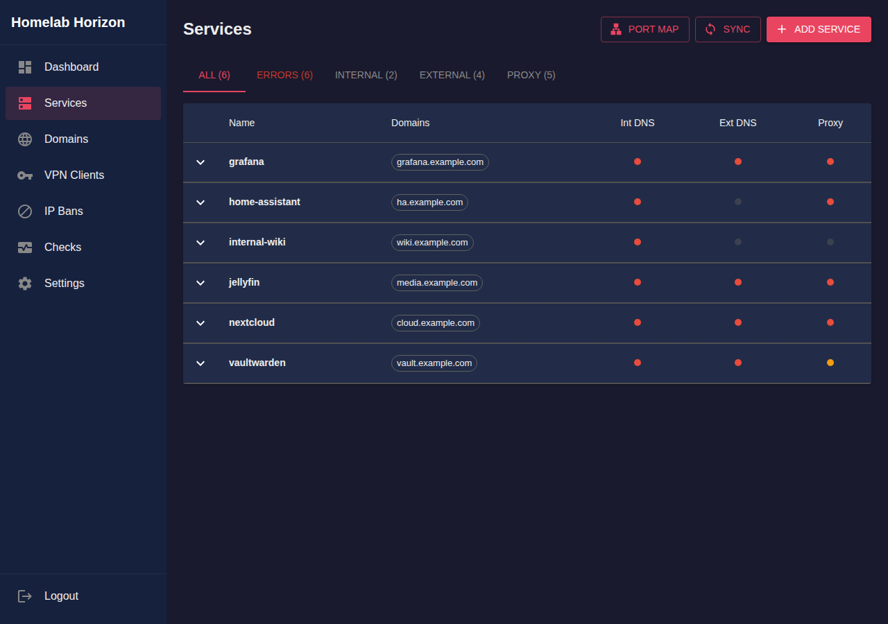
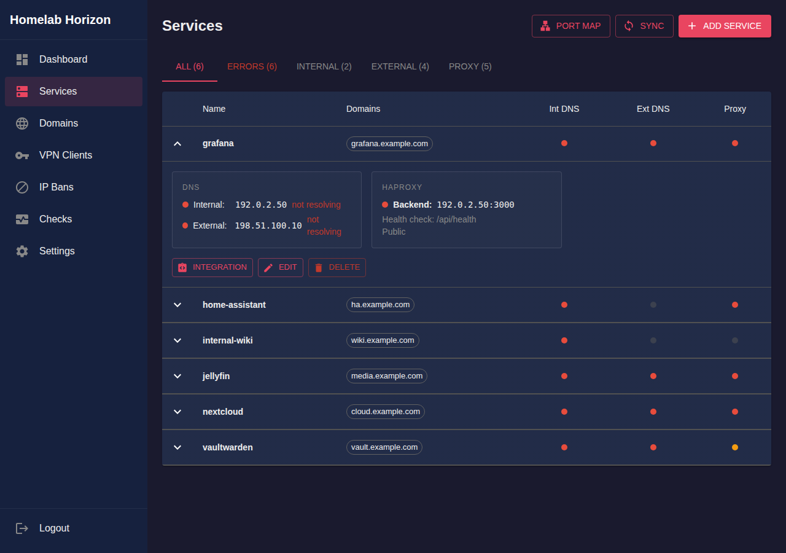
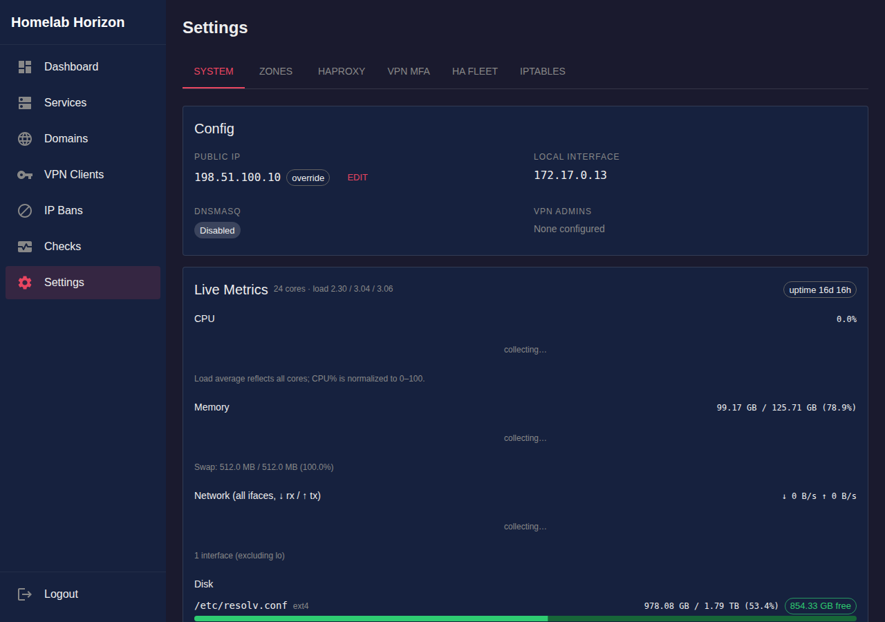

# Homelab Horizon

A self-contained homelab management tool for WireGuard VPN, split-horizon DNS, reverse proxy, and service monitoring. Single binary, runs on Ubuntu/Debian.

## The Problem

Running a homelab with external access means juggling multiple systems that don't talk to each other:

- **SSL Certificate Sprawl**: Managing 12+ individual certificates, each with their own renewal schedule
- **Internal SSL Headaches**: HTTPS doesn't work from inside your network because certs are tied to external IPs, so you're stuck with HTTP internally or browser warnings
- **Unnecessary Public Exposure**: OAuth callbacks and other endpoints need valid SSL, forcing you to expose internal-only services to the internet just to get certificates
- **Manual DNS Management**: Updating Route53 or other DNS providers by hand every time your IP changes or you add a service
- **Broken Internal Resolution**: Your domains work from the internet but timeout when you're on your own network (the classic split-horizon DNS problem)
- **WireGuard Friction**: Every new device needs a config file, QR code, and manual peer setup on the server
- **Scattered Configuration**: HAProxy configs, DNS records, WireGuard peers, and SSL certs all managed separately with no unified view

## The Solution

Homelab Horizon consolidates all of this into a single web UI:

- **Consolidated Certs**: Wildcard certs only cover one level (`*.example.com` won't cover `app.sub.example.com`), so we make it easy to add extra SANs like `*.vpn.example.com` - all visible and editable in the UI, and you can inspect exactly what each cert covers. No more mystery broken SSL.
- **HTTPS Everywhere**: Same SSL cert works internally - no more HTTP fallbacks or certificate warnings on your LAN
- **Automatic DNS Sync**: Add a service, DNS records update automatically (Route53, Cloudflare, Name.com, and more)
- **Split-Horizon Built-in**: Services resolve to internal IPs on your network/VPN, external IPs from the internet
- **Self-Service VPN**: Generate invite links - users scan a QR code and they're connected
- **Unified Dashboard**: See all your services, their health status, DNS records, and SSL certificates in one place

## Screenshots

### Services


### Service Detail


### Settings


## Features

- **Auto-Heal**: Detects and installs missing dependencies on a fresh Ubuntu system
- **WireGuard VPN Management**: Create clients, generate QR codes, manage peers
- **Split-Horizon DNS**: Internal DNS via dnsmasq, external DNS via Route53, Name.com, Cloudflare, and more
- **Reverse Proxy**: HAProxy with automatic Let's Encrypt wildcard SSL certificates
- **Service Monitoring**: Health checks with ntfy push notifications
- **Self-Service Onboarding**: Users redeem invite tokens to get VPN configs
- **IP Banning**: Per-service IP bans with timeout support
- **Rolling Deploys**: Blue-green deployment support with hz-client CLI
- **Multi-Instance HA**: Run two boxes for automatic config replication, cert failover, and round-robin DNS
- **MCP Server**: Machine-readable API for AI-assisted management

## Quick Start

### Kick the tires (Docker)

```bash
cd examples/simple
./setup.sh            # generate WG keys and config
docker compose up -d  # start HZ
```

Open `http://localhost:8090` and log in with the admin token:

```bash
docker exec hz cat /etc/homelab-horizon/config.json.token
```

### Bare metal install

```bash
# Build (requires Go 1.25+ and Node.js)
make

# Run as root (WireGuard, dnsmasq, HAProxy, iptables, ports 80/443, systemd)
sudo ./homelab-horizon
```

On first run, the binary:
1. Copies itself to `/usr/local/bin/`
2. Installs a systemd service
3. Writes an admin token to `/etc/homelab-horizon/config.json.token`

With `auto_heal: true`, it detects and installs missing packages (`wireguard-tools`, `iproute2`, `haproxy`, `dnsmasq`) via `apt-get`.

Pass config via environment for Docker or backup/restore workflows:

```bash
sudo HZ_CONFIG='{"listen_addr":":8080","auto_heal":true,...}' ./homelab-horizon
```

### Growing with you

HZ scales from a single box to a redundant pair without reconfiguration. When you're ready, add a second instance:

- **Same-subnet** (two boxes in one rack or VPC): low complexity, shared VPN range, LAN replication
- **Cross-site** (two locations or availability zones): WireGuard tunnel between peers, disjoint VPN ranges, full geo-redundancy

```bash
cd examples/ha-same-subnet && ./setup.sh && docker compose up -d
cd examples/ha-site-to-site && ./setup.sh && docker compose up -d
```

See the [High Availability](#high-availability) section and [examples/](examples/) for details.

## Setup Guide

### Step 1: Get a Domain

You need a domain where you control DNS. Supported providers:

- **AWS Route53**
- **Cloudflare**
- **Name.com**
- **DigitalOcean**
- **Hetzner**
- **Gandi**
- **Google Cloud DNS**
- **DuckDNS**

### Step 2: Configure Your Router

1. **Static DHCP**: Give the Homelab Horizon device a fixed IP
2. **DNS Server**: Point network DNS to the Homelab Horizon device
3. **Port Forwarding**:
   - `51820/UDP` - WireGuard VPN
   - `80/TCP` - HTTP (Let's Encrypt challenges)
   - `443/TCP` - HTTPS (reverse proxy)

### Step 3: Configure Zones & Services

1. Add a DNS zone with your domain and provider credentials
2. Add services — each gets a domain, internal DNS, optional external DNS, and optional HAProxy backend
3. Click "Sync DNS, SSL & HAProxy" to apply everything

## Zones & Domains

A **zone** represents a domain you own (e.g., `example.com`) and connects it to your DNS provider. Once a zone is configured, you can add services under it with any subdomain.

### Wildcard SSL

Each zone automatically gets a wildcard SSL certificate (`*.example.com`) via Let's Encrypt DNS-01 challenges. This means any service like `grafana.example.com` or `wiki.example.com` gets valid HTTPS with no per-service cert management.

For deeper subdomains, add **sub-zones**. For example, adding `"vpn"` as a sub-zone to `example.com` gets you a `*.vpn.example.com` wildcard — so VPN client names like `carl.vpn.example.com` also get valid SSL.

### Adding Services

Once your zone is set up, adding a service is straightforward:

- **Name**: human-readable identifier (e.g., `grafana`)
- **Domains**: one or more FQDNs under your zone (e.g., `grafana.example.com`)
- **Internal DNS**: the LAN IP that VPN/local clients should resolve to (e.g., `192.168.1.50`)
- **External DNS**: enables public DNS records pointing to your public IP (auto-detected)
- **Proxy**: HAProxy backend (`host:port`) — can be a LAN service or an external host

Services don't have to be on your local network. The proxy backend can point to any reachable host:port — a Raspberry Pi on your LAN, a VM in the cloud, or a container on the same machine.

## High Availability

Run two HZ instances for automatic failover. No orchestrator, no election, no shared state — just two boxes.

Capabilities: config replication, cert renewal failover, round-robin DNS, read-only guard on the spare.

**Failover:** when the primary dies permanently, remove it from the spare's fleet peer list. The spare detects it has no primary to follow and promotes itself — no SSH, no config editing, no restart.

### How it works

1. **One primary, one spare.** The primary is the single config writer. The spare pulls config every 30s, validates, and applies changes.
2. **Cert ownership is deterministic.** Each SSL domain is assigned to one peer via consistent hashing. If the owner dies, ownership shifts automatically and the survivor renews.
3. **DNS has both IPs.** Round-robin DNS gives clients both addresses. Browsers retry on TCP failure — failover is automatic.
4. **Edit on the primary.** The spare's UI shows a read-only banner. Mutating API calls return 403 with the primary's ID.
5. **Promotion is automatic.** Remove the dead primary from the spare's peer list — the spare promotes itself on the next sync cycle.

### Two topologies

| | Same-subnet | Site-to-site |
|---|---|---|
| Use case | Two boxes in one DC/VPC | Two boxes at different locations |
| Fleet comms | LAN IP | WireGuard tunnel IP |
| VPN range | Shared `/24` | Disjoint `/24` per site |
| Complexity | Low | Medium (pre-configure s2s tunnel) |

### Try it

```bash
# Same-subnet HA (startup scenario)
cd examples/ha-same-subnet && ./setup.sh && docker compose up -d

# Site-to-site HA (homelab scenario)
cd examples/ha-site-to-site && ./setup.sh && docker compose up -d
```

Each example includes a `test.sh` that verifies startup, replication, guard middleware, and failover. See [docs/common-scenarios.md](docs/common-scenarios.md) for the full story.

### Fleet config

Add to each instance's `config.json`:

```json
{
  "peer_id": "hz1",
  "config_primary": true,
  "peers": [
    { "id": "hz2", "wg_addr": "10.0.0.2:8080" }
  ]
}
```

The spare mirrors this with `"config_primary": false` and marks the primary peer with `"primary": true`.

## Architecture

```
                    Internet
                       |
           +-----------+-----------+
           |                       |
    Remote VPN Clients      Public HTTPS Traffic
    (phone, laptop, etc.)   (grafana.example.com)
           |                       |
           | :51820/UDP            | :80/:443
           v                       v
       +-------+              +--------+
       |Router |------------->| Router |
       +-------+              +--------+
           |                       |
           v                       v
    +----------------------------------------------+
    |            Homelab Horizon                    |
    |                                              |
    |  WireGuard ---- dnsmasq ---- HAProxy + SSL   |
    |  (VPN server)  (split DNS)  (reverse proxy)  |
    +----------------------------------------------+
           |              |              |
           v              v              v
    +-----------+  +-----------+  +-----------+
    | Local VPN |  | LAN       |  | External  |
    | Clients   |  | Services  |  | Services  |
    | (on-site) |  |           |  |           |
    +-----------+  | grafana   |  | cloud-app |
                   | :3000     |  | :8080     |
                   | nextcloud |  +-----------+
                   | :8080     |
                   | NAS :445  |
                   +-----------+
```

VPN clients can connect from anywhere — inside your network or remotely over the internet. Services can be local LAN hosts (e.g., `192.168.1.50:3000`) or external targets (e.g., a cloud VM). HAProxy terminates SSL and proxies to the configured backend, wherever it lives.

### Split-Horizon DNS

The same domain resolves differently depending on where you are:

| Location | DNS Resolution | Path |
|----------|---------------|------|
| On VPN (remote) | Internal IP (e.g., 192.168.1.50) | VPN tunnel -> direct to service |
| On VPN (local) | Internal IP (e.g., 192.168.1.50) | Direct to service |
| Local Network | Internal IP (via dnsmasq) | Direct to service |
| Public Internet | Your Public IP | Router -> HAProxy -> Service |

This means `grafana.example.com` works with valid HTTPS from everywhere — your couch, your phone on cellular, or the public internet.

## Building

### Quick Build (current platform)

```bash
make
```

### Cross-Platform Builds

Build for all supported platforms:

```bash
make build-all
```

Or build for specific targets:

```bash
make build-linux-amd64   # Linux x86_64 (most servers/VMs)
make build-linux-arm64   # Raspberry Pi 4/5, modern ARM64 servers
make build-linux-arm     # Raspberry Pi 2/3, older 32-bit ARM
```

Binaries are output to `dist/`.

### Create Release Archives

```bash
make release
```

Creates `.tar.gz` archives for each platform in `dist/`.

### Manual Build (without Make)

```bash
# Current system
CGO_ENABLED=0 go build -o homelab-horizon ./cmd/homelab-horizon

# Raspberry Pi 4/5 (ARM64)
CGO_ENABLED=0 GOOS=linux GOARCH=arm64 go build -o homelab-horizon-arm64 ./cmd/homelab-horizon

# Raspberry Pi 2/3 (32-bit ARM)
CGO_ENABLED=0 GOOS=linux GOARCH=arm GOARM=7 go build -o homelab-horizon-armv7 ./cmd/homelab-horizon
```

Note: `CGO_ENABLED=0` creates a fully static binary with no external dependencies.

## Configuration

Configuration is stored in JSON (with `//` comment support). Locations searched (in order):

1. `/etc/homelab-horizon/config.json`
2. `/etc/homelab-horizon.json`
3. `./config.json`
4. `./homelab-horizon.json`

Alternatively, pass the full config as JSON via the `HZ_CONFIG` environment variable.

### Example Configuration

```json
{
  "listen_addr": ":8080",
  "auto_heal": true,

  "wg_interface": "wg0",
  "wg_config_path": "/etc/wireguard/wg0.conf",
  "server_endpoint": "vpn.example.com:51820",
  "vpn_range": "10.100.0.0/24",
  "dns": "10.100.0.1",

  "dnsmasq_enabled": true,
  "haproxy_enabled": true,
  "ssl_enabled": true,

  "zones": [
    {
      "name": "example.com",
      "zone_id": "Z1234567890",
      "dns_provider": {
        "type": "route53",
        "aws_profile": "default"
      },
      "ssl": {
        "enabled": true,
        "email": "admin@example.com"
      },
      "sub_zones": ["vpn"]
    }
  ],
  "services": [
    {
      "name": "grafana",
      "domains": ["grafana.example.com"],
      "internal_dns": { "ip": "192.168.1.50" },
      "external_dns": { "ttl": 300 },
      "proxy": {
        "backend": "192.168.1.50:3000",
        "health_check": { "path": "/api/health" }
      }
    }
  ],
  "ntfy_url": "https://ntfy.sh/my-homelab-alerts"
}
```

## Web Interface

| Page | Description |
|------|-------------|
| `/app/dashboard` | Overview dashboard |
| `/app/services` | Service management — domains, DNS, proxy, health status |
| `/app/domains` | External DNS records and sync status |
| `/app/vpn` | VPN client management — create clients, QR codes, invites |
| `/app/bans` | IP ban management |
| `/app/checks` | Health check status and notifications |
| `/app/settings` | Zones, HAProxy, SSL, health checks, system config |

## DNS Providers

Configure your provider in the zone's `dns_provider` block:

| Provider | Type | Required Fields |
|----------|------|----------------|
| AWS Route53 | `route53` | `aws_profile` or `aws_access_key_id` + `aws_secret_access_key` |
| Cloudflare | `cloudflare` | `cloudflare_api_token` |
| Name.com | `namecom` | `namecom_username` + `namecom_api_token` |
| DigitalOcean | `digitalocean` | `api_token` |
| Hetzner | `hetzner` | `api_token` |
| Gandi | `gandi` | `api_token` |
| Google Cloud DNS | `googlecloud` | `gcp_project` (+ optional `gcp_service_account_json`) |
| DuckDNS | `duckdns` | `api_token` |

## Health Checks

Services with HAProxy backends automatically get health checks. Configure ntfy URL to receive push notifications when services go down.

Check types:
- **ping**: TCP connect to common ports (80, 443, 22)
- **http**: HTTP GET expecting 200 response

## SSL Certificates

Wildcard certificates are automatically obtained via Let's Encrypt using DNS-01 challenges. A background sweep runs every 12 hours and renews certificates within 30 days of expiry — no operator action needed.

In an HA fleet, cert renewal is deterministic: each domain is assigned to one peer. If that peer dies, ownership shifts automatically and the survivor renews. Non-owners pull certs from the owner.

Certificates cover:
- `*.example.com` (base zone)
- `*.vpn.example.com` (sub-zones you configure)

## Requirements

- Ubuntu/Debian Linux
- Go 1.25+ and Node.js (for building from source)
- Root access — needed for WireGuard, dnsmasq, HAProxy, iptables, systemd service management, and binding ports 80/443

Runtime packages (auto-installed when `auto_heal` is enabled):
- `iproute2` - Network interface management
- `wireguard-tools` - VPN management
- `haproxy` - Reverse proxy (when `haproxy_enabled`)
- `dnsmasq` - Internal DNS (when `dnsmasq_enabled`)
- `iptables` - NAT masquerading
- `qrencode` - VPN client QR codes

## License

MIT
