# Homelab Horizon

A self-contained homelab management tool for WireGuard VPN, split-horizon DNS, reverse proxy, and service monitoring. Single binary, runs on Ubuntu/Debian.

**Website: [homelab-horizon.iodesystems.com](https://homelab-horizon.iodesystems.com)** · the official, original project — accept no clones.

## The Problem

Running a homelab with external access means juggling multiple systems that don't talk to each other:

- **SSL Certificate Sprawl**: Managing 12+ individual certificates, each with their own renewal schedule
- **Internal SSL Headaches**: HTTPS doesn't work from inside your network because certs are tied to external IPs, so you're stuck with HTTP internally or browser warnings
- **Unnecessary Public Exposure**: OAuth callbacks and other endpoints need valid SSL, forcing you to expose internal-only services to the internet just to get certificates
- **Manual DNS Management**: Updating Route53 or other DNS providers by hand every time your IP changes or you add a service
- **Broken Internal Resolution**: Your domains work from the internet but timeout when you're on your own network (the classic split-horizon DNS problem)
- **WireGuard Friction**: Every new device needs a config file, QR code, and manual peer setup on the server
- **Scattered Configuration**: HAProxy configs, DNS records, WireGuard peers, and SSL certs all managed separately with no unified view

## The Solution

Homelab Horizon consolidates all of this into a single web UI:

- **Consolidated Certs**: Wildcard certs only cover one level (`*.example.com` won't cover `app.sub.example.com`), so we make it easy to add extra SANs like `*.vpn.example.com` - all visible and editable in the UI, and you can inspect exactly what each cert covers. No more mystery broken SSL.
- **HTTPS Everywhere**: Same SSL cert works internally - no more HTTP fallbacks or certificate warnings on your LAN
- **Automatic DNS Sync**: Add a service, DNS records update automatically (Route53, Cloudflare, Name.com, and more)
- **Split-Horizon Built-in**: Services resolve to internal IPs on your network/VPN, external IPs from the internet
- **Self-Service VPN**: Generate invite links - users scan a QR code and they're connected
- **Unified Dashboard**: See all your services, their health status, DNS records, and SSL certificates in one place

## Screenshots

### Dashboard
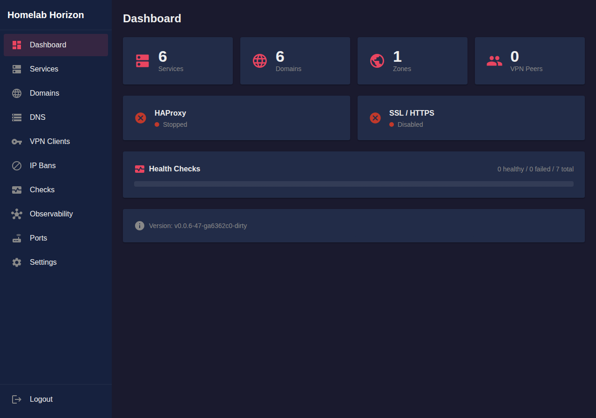

### Services
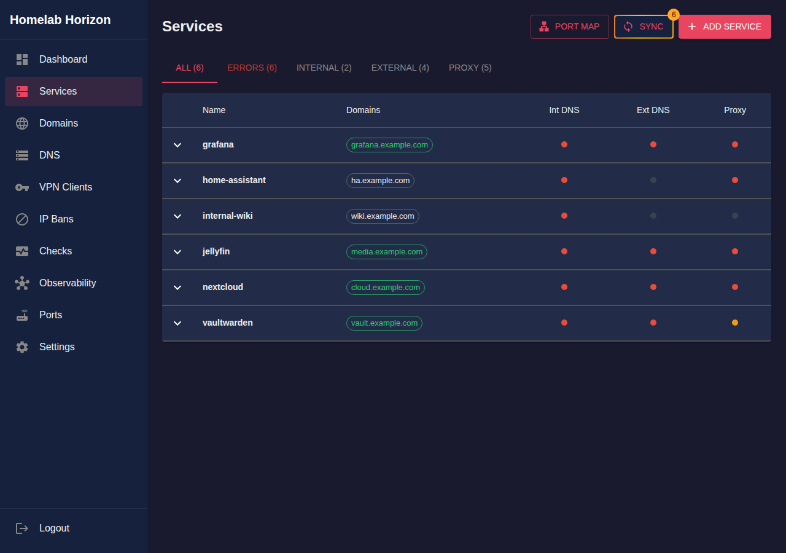

### Service Detail
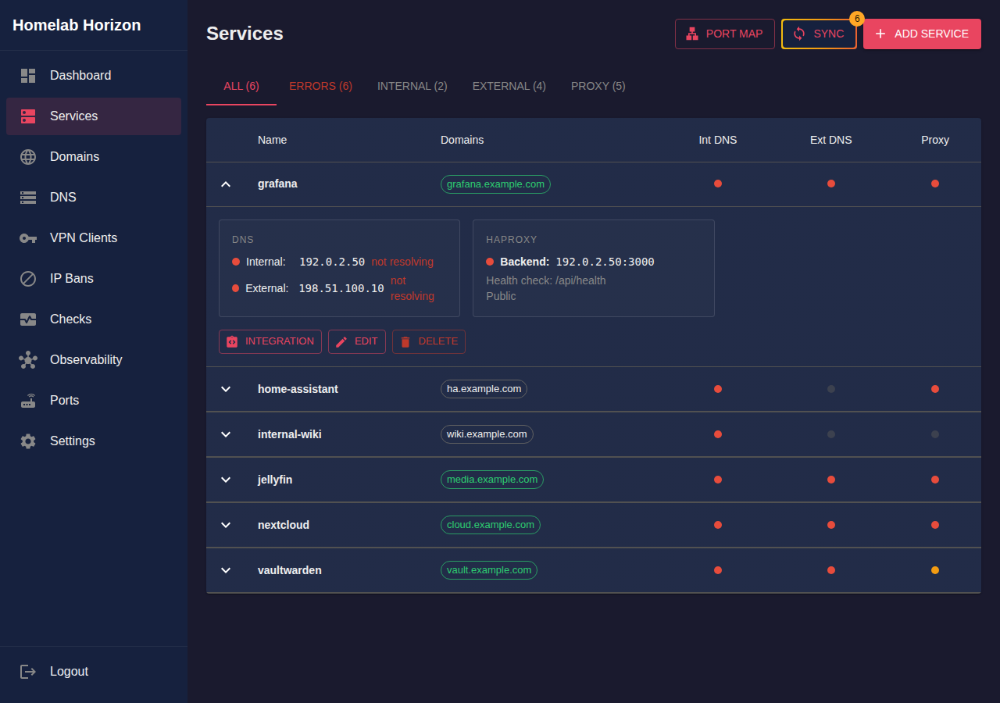

### Deleting a service
Deleting doesn't silently strand the state a service didn't own — the zone
SubZone that gave its domain HTTPS, and the record published at your DNS
provider. Both are listed, and the delete won't proceed until you say whether
to retract them.

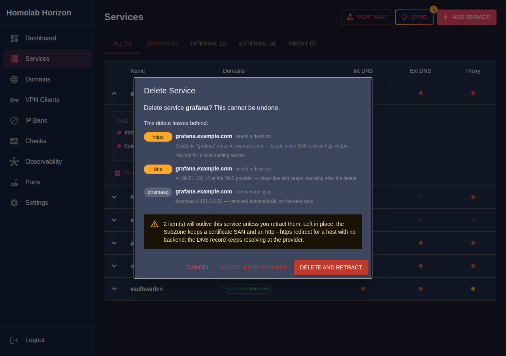

### DNS
Zones hz publishes to, and per zone every record live at the provider labelled
by who owns it — `derived` from a service, `declared` on the zone, `observed`
(not hz's, never rewritten), or `tombstoned` (deletion pending).

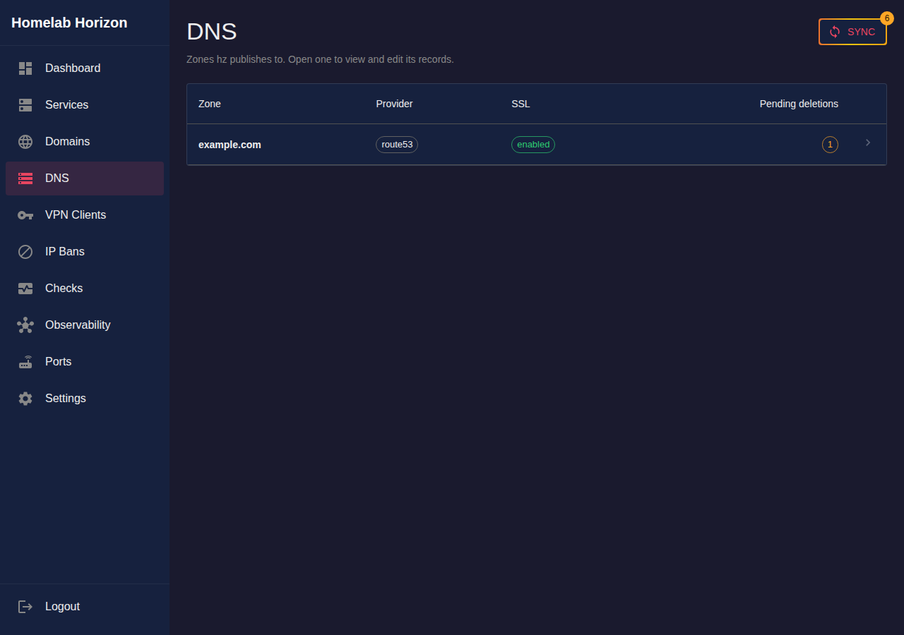

### Domains
Every domain hz knows, with internal DNS, external DNS, proxy and HTTPS state
side by side — plus the SSL coverage gaps and the zone records it publishes.

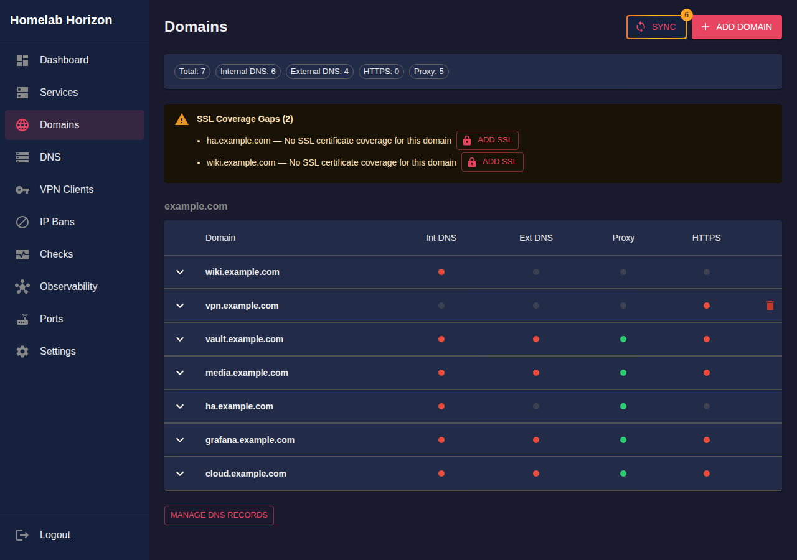

### Observability
Declare hosts and exporter jobs, then hand Prometheus a generated scrape config.

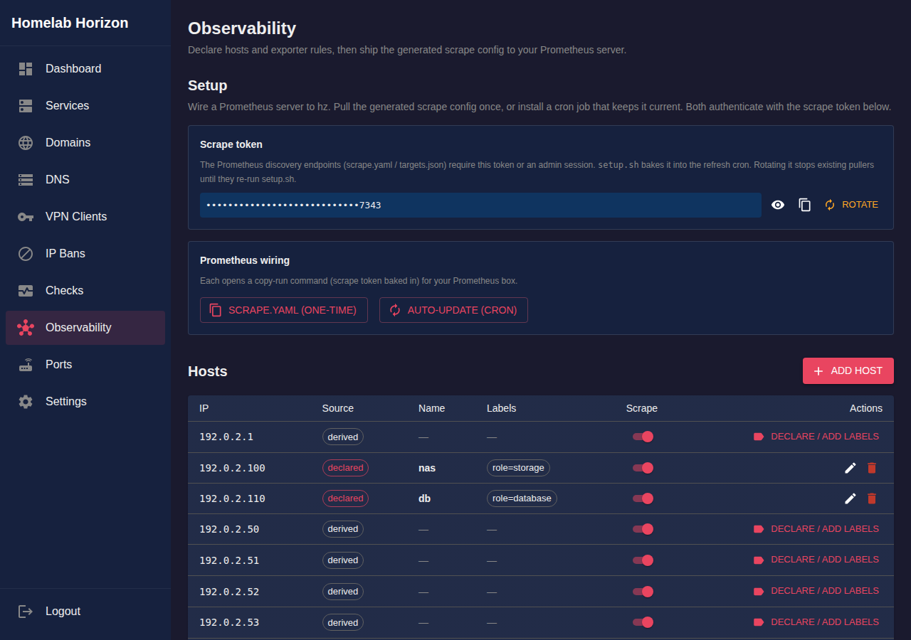

### Ports
Reserved ports per host, and the denylist `hz ports next` skips when allocating.

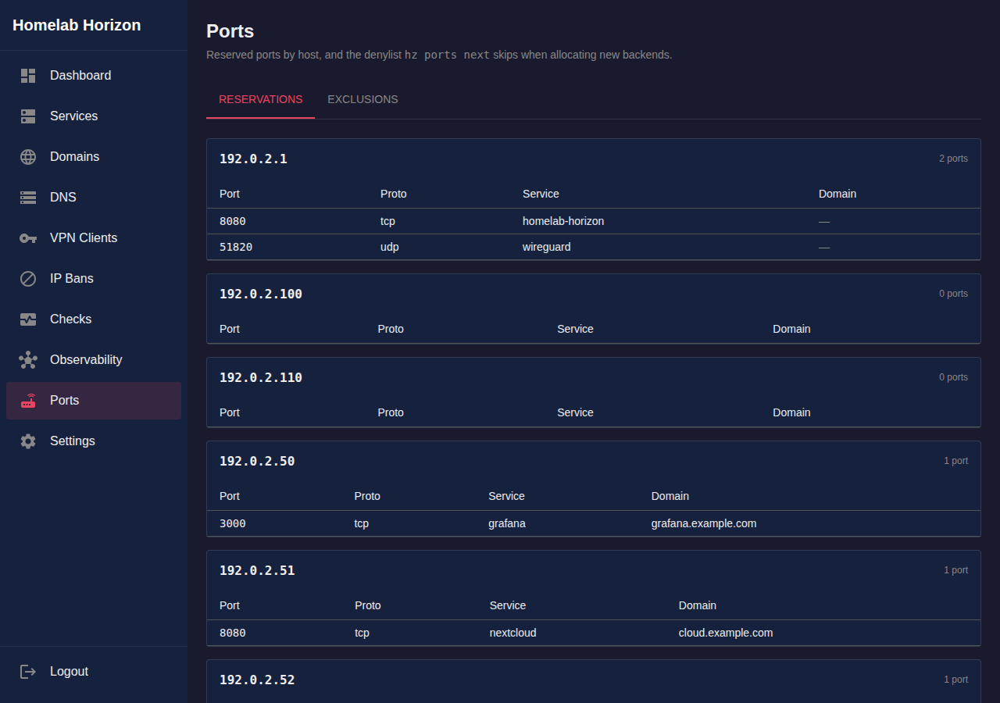

### Port Map
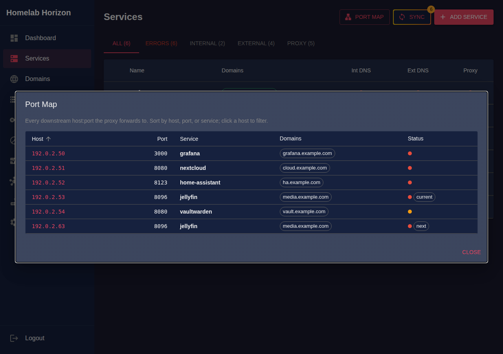

### Settings
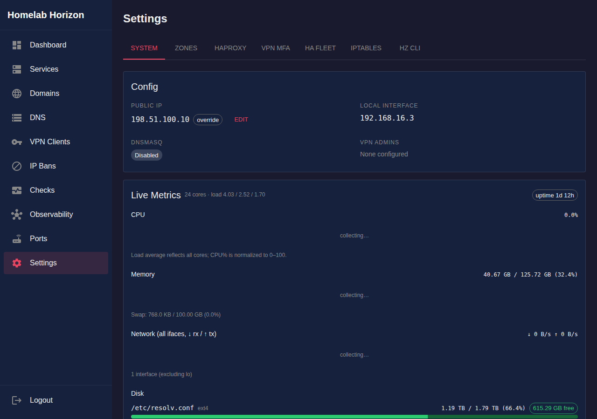

### VPN MFA captive portal
What an MFA-jailed peer sees when it asks for any other service — the request
is redirected to the portal, and nothing else on the network answers until a
second factor is accepted. See [VPN MFA](#vpn-mfa).

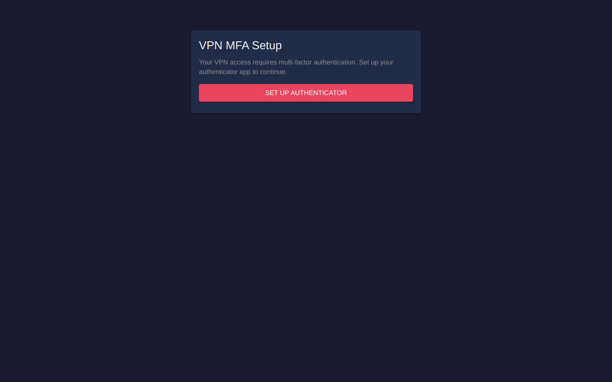

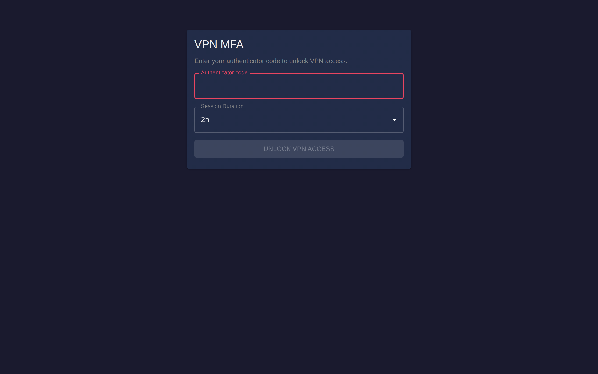

> These two come from `bin/e2e`, not `make screenshots`: the portal identifies
> the caller by WireGuard source IP, so the only honest way to photograph a
> jailed peer's view is to be one. The hermetic container has no WireGuard.

> The VPN and Checks pages are captured too (`docs/screenshots/{vpn,checks}.png`)
> but aren't shown here — the hermetic container has no live WireGuard peers and
> can't reach the documentation IPs it checks, so both render as empty or all-red
> and would misrepresent the pages. `dns-zone.png` (the per-zone record table) is
> likewise captured but not shown: the mock provider serialises the zone's SOA
> value as a Python repr, which looks like an hz bug and isn't one.

> Regenerate with `make screenshots` — boots a hermetic Docker container
> (daemons off, RFC 5737 documentation IPs, no outbound network) and captures
> these with Playwright. See [docs/take-screenshots.mjs](docs/take-screenshots.mjs).
>
> `DNS_FIXTURE=1 ./bin/screenshots` additionally boots a mock Route53
> (`motoserver/moto`) seeded with a zone, so the DNS pages capture real records
> instead of an empty state. Opt-in: it needs the aws CLI and pulls a ~400MB
> image. The DNS shots above were taken with it.

## Features

- **Auto-Heal**: Detects and installs missing dependencies on a fresh Ubuntu system
- **WireGuard VPN Management**: Create clients, generate QR codes, manage peers
- **VPN MFA**: Optional per-peer TOTP or passkey (codes recommended for full-tunnel peers — [why](#️-full-tunnel-peers-phone-scanned-passkeys-do-not-work)). Peers without a verified session are jailed to a captive portal until they authenticate
- **Split-Horizon DNS**: Internal DNS via dnsmasq, external DNS via Route53, Name.com, Cloudflare, and more
- **Reverse Proxy**: HAProxy with automatic Let's Encrypt wildcard SSL certificates
- **Static Sites**: Serve a folder of files as a service — hz hosts it directly, HAProxy routes to it with the same auto SSL/DNS
- **Service Monitoring**: Health checks with ntfy push notifications
- **Prometheus Discovery**: Declare hosts and exporter jobs; hz serves a generated scrape config and probes every target
- **Port Allocation**: Server-authoritative reservations and denylist, so `hz ports next` never hands out a port something already uses
- **Operator CLI (`hz`)**: Service CRUD, HTTPS per domain, hosts, exporters, sync — with a preview of what a mutation actually changes
- **Honest Deletes**: Deleting a service reports the SubZone and DNS record it would strand, and makes you choose
- **Unsynced-Change Tracking**: `hz pending` and a badge in the UI show what's edited but not yet published
- **Self-Service Onboarding**: Users redeem invite tokens to get VPN configs
- **IP Banning**: Per-service IP bans with timeout support
- **Rolling Deploys**: Blue-green deployment support with hz-client CLI
- **Multi-Instance HA**: Run two boxes for automatic config replication, cert failover, and round-robin DNS
- **MCP Server**: Machine-readable API for AI-assisted management

## Quick Start

### Kick the tires (Docker)

```bash
cd examples/simple
./setup.sh            # generate WG keys and config
docker compose up -d  # start HZ
```

Open `http://localhost:8090` and log in with the admin token:

```bash
docker exec hz cat /etc/homelab-horizon/config.json.token
```

### Bare metal install

```bash
# Build (requires Go 1.25+ and Node.js)
make

# Run as root (WireGuard, dnsmasq, HAProxy, iptables, ports 80/443, systemd)
sudo ./homelab-horizon
```

On first run, the binary:
1. Copies itself to `/usr/local/bin/`
2. Installs a systemd service
3. Writes an admin token to `/etc/homelab-horizon/config.json.token`

With `auto_heal: true`, it detects and installs missing packages (`wireguard-tools`, `iproute2`, `haproxy`, `dnsmasq`) via `apt-get`.

Pass config via environment for Docker or backup/restore workflows:

```bash
sudo HZ_CONFIG='{"listen_addr":":8080","auto_heal":true,...}' ./homelab-horizon
```

### Growing with you

HZ scales from a single box to a redundant pair without reconfiguration. When you're ready, add a second instance:

- **Same-subnet** (two boxes in one rack or VPC): low complexity, shared VPN range, LAN replication
- **Cross-site** (two locations or availability zones): WireGuard tunnel between peers, disjoint VPN ranges, full geo-redundancy

```bash
cd examples/ha-same-subnet && ./setup.sh && docker compose up -d
cd examples/ha-site-to-site && ./setup.sh && docker compose up -d
```

See the [High Availability](#high-availability) section and [examples/](examples/) for details.

## Setup Guide

### Step 1: Get a Domain

You need a domain where you control DNS. Supported providers:

- **AWS Route53**
- **Cloudflare**
- **Name.com**
- **DigitalOcean**
- **Hetzner**
- **Gandi**
- **Google Cloud DNS**
- **DuckDNS**

### Step 2: Configure Your Router

1. **Static DHCP**: Give the Homelab Horizon device a fixed IP
2. **DNS Server**: Point network DNS to the Homelab Horizon device
3. **Port Forwarding**:
   - `51820/UDP` - WireGuard VPN
   - `80/TCP` - HTTP (Let's Encrypt challenges)
   - `443/TCP` - HTTPS (reverse proxy)

### Step 3: Configure Zones & Services

1. Add a DNS zone with your domain and provider credentials
2. Add services — each gets a domain, internal DNS, optional external DNS, and optional HAProxy backend
3. Click "Sync DNS, SSL & HAProxy" to apply everything

## Zones & Domains

A **zone** represents a domain you own (e.g., `example.com`) and connects it to your DNS provider. Once a zone is configured, you can add services under it with any subdomain.

### Wildcard SSL

Each zone automatically gets a wildcard SSL certificate (`*.example.com`) via Let's Encrypt DNS-01 challenges. This means any service like `grafana.example.com` or `wiki.example.com` gets valid HTTPS with no per-service cert management.

For deeper subdomains, add **sub-zones**. For example, adding `"vpn"` as a sub-zone to `example.com` gets you a `*.vpn.example.com` wildcard — so VPN client names like `carl.vpn.example.com` also get valid SSL.

### Adding Services

Once your zone is set up, adding a service is straightforward:

- **Name**: human-readable identifier (e.g., `grafana`)
- **Domains**: one or more FQDNs under your zone (e.g., `grafana.example.com`)
- **Internal DNS**: the LAN IP that VPN/local clients should resolve to (e.g., `192.168.1.50`)
- **External DNS**: enables public DNS records pointing to your public IP (auto-detected)
- **Proxy**: HAProxy backend (`host:port`) — can be a LAN service or an external host

Services don't have to be on your local network. The proxy backend can point to any reachable host:port — a Raspberry Pi on your LAN, a VM in the cloud, or a container on the same machine.

### Managing services from the CLI (`hz`)

`hz` is an operator CLI for driving a whole instance from your workstation — service list/show/create/edit/delete plus a global sync. It's distinct from the per-service `hz-client` (which is service-token scoped, for deploys/bans/site uploads): `hz` authenticates with the instance **admin token**.

Install it straight from the instance (detects your OS/arch, drops the binary in `~/.local/bin` or `/usr/local/bin`, and — if you pass a token — writes `~/.hz_config`):

```bash
curl -fsSL $HZ_URL/admin/hz/install | HZ_HOST=$HZ_URL HZ_TOKEN=<admin-token> bash
```

The binaries are served by the instance itself (no GitHub needed). Omit `HZ_TOKEN` to install the binary only, or build locally with `make build-hz`. Either way `hz` reads `~/.hz_config`:

```json
{ "host": "http://192.168.1.89:8080", "token": "<admin-token>" }
```

(`HZ_HOST`/`HZ_TOKEN` env or `--host`/`--token` flags override the file.)

```bash
hz service list                      # table of all services
hz service show grafana --json       # one service
hz setup                             # interactive questionnaire -> create + sync
hz service create --name ebb --domain ebb.example.com \
    --backend 192.168.1.76:8300 --internal-only --health-check /healthz --sync
hz service edit ebb --public         # only the flags you pass change
hz service create --name shop --domain lan.example.com \
    --domains-https www.example.com --backend 192.168.1.76:8080
                                     # lan.example.com stays HTTP, www.example.com gets HTTPS
hz service edit ebb --https --confirm # HTTPS on every domain of the service
hz domain list                       # every domain: service, zone, HTTPS coverage, cert
hz domain ssl add ebb.example.com    # give one domain HTTPS
hz domain ssl rm ebb.example.com --confirm
                                     # drop it back to plain HTTP
hz service delete ebb                # reports what the delete would strand, then refuses
hz service delete ebb --delete-orphans --sync
                                     # ...also retract the SubZone + published DNS record
hz sync --wait                       # trigger a global sync, block until done
hz pending                           # show unsynced config changes
hz ports list --host 192.168.1.76    # reserved ports on a host + suggested free ports
hz ports next --host 192.168.1.76 --count 100
                                     # next free port range (safe band 20000+, common dev ports skipped)
hz schema service                    # dump the request schema (reflected from apitypes)
```

`hz --help` lists every command and flag; `hz schema service` prints the exact JSON request shape the server accepts (generated from the shared `internal/apitypes` structs, so it never drifts).

Deleting is the one mutation that can leave state behind, because a service
doesn't own everything it depends on. The zone SubZone giving its domain HTTPS
lives on the *zone*, and the record published at your DNS provider lives at the
*provider* — neither disappears with the service. `hz service delete` prints
both and stops until you pick `--delete-orphans` or `--keep-orphans`:

```
$ hz service delete grafana
Deleting "grafana" leaves behind:

  ! https grafana.example.com            SubZone "grafana" on zone example.com — keeps a cert SAN and an http->https redirect for a host nothing serves
  ! dns   grafana.example.com            A 198.51.100.10 at the DNS provider — stays live and keeps resolving after the delete
  . dns   grafana.example.com            dnsmasq A 192.0.2.50 — removed automatically on the next sync

  ! needs a decision   . goes away on sync   = shared, left alone

error: this delete strands 2 item(s) listed above — re-run with --delete-orphans or --keep-orphans
```

Coverage inherited from a wildcard SubZone, and any SubZone another service
still uses, are reported as shared and never offered for deletion. A service
that strands nothing deletes without asking anything.

### Static Sites

A service can serve a folder of files instead of proxying to a backend. Set `proxy.static_root` to an absolute directory (mutually exclusive with `proxy.backend`):

```json
{
  "name": "docs",
  "domains": ["docs.example.com"],
  "external_dns": { "ttl": 300 },
  "proxy": { "static_root": "/var/lib/homelab-horizon/docs" }
}
```

HAProxy can't serve a directory itself, so hz runs a small internal file server (loopback-only, port `static_serve_port`, default `8091`) and routes the service's domains to it by Host header. Static services inherit wildcard SSL, split-horizon DNS, and the `internal_only` restriction exactly like proxied ones.

hz runs as root, but **the file server does not**: it runs as a separate child process dropped to the unprivileged `nobody` user, so it physically cannot read files `nobody` can't — even a bug in the handler can't leak root-only secrets. (If hz can't drop privileges, it refuses to serve static rather than serve as root.) The served directory must therefore be readable by `nobody`.

On top of that, the file server is deliberately strict:

- Bound to `127.0.0.1` only — never directly reachable off-box.
- Every file open is pinned inside `static_root` via `os.Root`; `../` and symlinks **cannot** escape the directory.
- Dotfiles and dot-directories (`.git`, `.env`, `.ssh`) are never served.
- Directories are never listed — a directory serves its `index.html` or returns 404.
- `static_root` cannot be the filesystem root or a system directory (`/etc`, `/root`, `/proc`, …) — checked even through symlinks.
- `Content-Type` is set explicitly from the file extension (no content sniffing), and `X-Content-Type-Options: nosniff` is sent on every response.
- Errors render a standard hz error page, or the site's own `404.html` / `5xx.html` if present. (A wholly missing/unreadable root can't read its own error page, so that case always shows the built-in page.)

Point `static_root` at a directory containing only files you intend to publish.

For single-page apps, set `"spa": true` so a browser refresh on a client-side route (a path with no file extension) serves `index.html` instead of 404:

```json
{ "name": "app", "domains": ["app.example.com"],
  "proxy": { "static_root": "/var/lib/homelab-horizon/app", "spa": true } }
```

### Deploying a static site

Upload a directory with `hz-client` (the same token-authed client used for rolling deploys; grab the snippet + token from the service's **Integration** panel in the UI):

```bash
export HZ_TOKEN=<service token>  HZ_URL=https://hz.example.com
curl -sO "$HZ_URL/admin/haproxy/hz-client" && chmod +x hz-client

./hz-client site push ./public             # upload as a new release, atomic swap
./hz-client site push ./public --validate  # dry run: extract + validate, no swap
./hz-client site releases                  # list retained releases
./hz-client site rollback                  # revert to the previous release
```

Deploys are **atomic**: the upload is extracted into a fresh release directory, then `static_root` (an hz-managed symlink) is repointed in a single rename — requests never see a half-written site. The last few releases are retained for `rollback`. Uploads are received by the root process, validated (no path traversal, no symlinks, size/file caps), and the files are owned by `nobody` so the unprivileged file server can read them.

This is how the project hosts its own landing page (`docs/`): a static service on the public domain, served by hz, with auto SSL.

## Observability

hz already knows every host and backend it routes to, so it can hand Prometheus
a scrape config instead of you maintaining one by hand. Declare the boxes it
*doesn't* route to (a NAS, a DB server), add exporter jobs, and pull the result.

```bash
hz host add --name nas --ip 192.0.2.100 --label role=storage
hz exporter add --job node --mode port --port 9100          # node_exporter on every known host
hz exporter add --job postgres --mode static --target 192.0.2.110:9187
hz exporter list                                            # jobs, then live targets with up/down
```

Three ways a job generates targets:

| Mode | Targets |
|------|---------|
| `port` | one port expanded across hosts (`--host '*'` = every host hz knows) |
| `service` | one target per service backend (per slot for blue-green), for services not already opted in |
| `static` | the explicit `--target` list |

Per-service metrics are opt-in and probed before they're served, so a service
only appears once hz has actually seen its endpoint respond:

```bash
hz service edit grafana --metrics --metrics-path /metrics --sync
```

The generated config is served at `/integration/prometheus/scrape.yaml` and
`/integration/prometheus/targets.json`, authorized by a **scrape token** that is
separate from the admin token — a scraper never holds admin rights. The
Observability page has copy-run snippets for both a one-time pull and a cron
that keeps it current.

## Ports

Picking a backend port by hand is how you end up with two services on 8080. hz
keeps a server-authoritative map of what's reserved — derived from service
backends, HAProxy and WireGuard — plus a built-in denylist of common ports and
whatever ranges you exclude yourself.

```bash
hz ports next --host 192.0.2.50              # next free port, denylist applied
hz ports next --host 192.0.2.50 --count 2    # a blue-green pair
hz ports list --host 192.0.2.50              # what's reserved, and what's free
```

`port_exclusions` in the config adds your own ranges on top of the built-in
list. The Ports page shows both tabs — reservations per host, and the exclusions
that allocation skips.

## Metrics

hz serves its own Prometheus exposition at `/metrics`, guarded by the same
admin-or-scrape-token check as the discovery endpoints — it names every peer's
MFA posture and where the gateway is soft.

It covers what only hz can answer, and **deliberately not host metrics**:

| Area | Examples |
|---|---|
| VPN | `hz_vpn_peers`, `hz_vpn_peers_recently_handshaked` |
| MFA | `hz_vpn_mfa_jailed_peers`, `hz_vpn_mfa_active_sessions`, `hz_vpn_mfa_enrolled_peers{factor}`, `hz_vpn_mfa_active_exceptions` |
| Edge | `hz_haproxy_backend_up{backend}`, `hz_banned_ips` |
| DNS | `hz_dnsmasq_cache_{hits,misses,insertions,evictions}_total`, `hz_dnsmasq_upstream_{queries,failures}_total{server}` |
| Drift | `hz_iptables_rules{state}` — sustained `unknown` or `stale` means something is editing your firewall |
| Controls | `hz_control_state{control,requirement}` |

`hz_control_state` reports whether a configurable security control is in its
hardened setting — `vpn_mfa_no_admin_bypass`, `vpn_mfa_session_bounded`, and so
on, labelled with the PCI DSS requirement each speaks to. It describes **hz's
configuration only**. Whether that satisfies a requirement is an assessor's
judgement over a defined scope, which is why nothing here is named
`hz_pci_compliant`.

### Everything else on the box

hz doesn't reimplement what already exists — it owns, installs, or detects:

- **HAProxy** — hz generates its config, so it switches on HAProxy's built-in
  exporter (`haproxy_metrics_port`, default 8405, `0` disables), restricted to
  RFC1918. No extra process; `prometheus-haproxy-exporter` would scrape the
  stats socket from outside for less detail.
- **dnsmasq** — hz reads dnsmasq's own CHAOS counters (`hits.bind`,
  `misses.bind`, `servers.bind`, …) directly and publishes them above. That's
  the same source [`google/dnsmasq_exporter`](https://github.com/google/dnsmasq_exporter)
  uses, but it isn't packaged for Debian or Ubuntu, so hz couldn't install it
  through the vetted allowlist it uses for everything else.
- **node-exporter** — hz *does not* compete with it for CPU/memory/disk. Set
  `node_exporter_enabled` and hz installs it; if you installed it yourself hz
  notices on its next health tick and switches the flag on for you. Either way
  it's folded into the scrape config hz serves as an ordinary `node` job over
  every known host.
- **Your services** — anything declaring `integrations.metrics` is probed and
  published in `/integration/prometheus/{scrape.yaml,targets.json}`.

So a central Prometheus points at one discovery endpoint and gets hz, HAProxy,
node-exporter and every compatible service, without per-host scrape config.

## VPN MFA

WireGuard has no second factor of its own. A peer either holds a valid key or
it doesn't, and the Noise handshake has no interactive step to hang a prompt
on. hz adds one *after* the tunnel comes up: a peer with no verified session
still completes its handshake, but is **jailed** — confined to the Horizon
portal until it enters a TOTP code.

That is a real distinction worth understanding before relying on it. This
gates what a peer can *reach*, not whether it can connect. A stolen key still
brings up a tunnel; it just lands somewhere with nothing in it.

Enable under **Settings → VPN Multi-Factor Authentication**, or set
`vpn_mfa_enabled` in `config.json`.

### What a jailed peer can reach

Nothing but the portal — enforced in three places, because no single one of
them covers the whole path:

| Layer | Where | Blocks |
|---|---|---|
| `WG-INPUT` | iptables, jumped from `INPUT -i wg0` | everything addressed to the gateway itself, except Horizon's port, HAProxy's ports, and DNS. That means sshd, exporters, and anything else bound to the WireGuard address. |
| `WG-FORWARD` | iptables, per-peer `DROP` | everything transiting the gateway to the LAN |
| `mfa_jailed` | HAProxy ACL, source list at `<haproxy dir>/mfa-jailed.lst` | every vhost except the portal; the rest redirect to `<kiosk_url>/app/mfa` |

The HAProxy half is not decoration. HAProxy fronts every other service and
originates those backend connections *itself*, so a jail that only covered
`WG-FORWARD` would hand a jailed peer the whole LAN through the proxy.
Conversely HAProxy never sees traffic aimed straight at sshd — that is
`WG-INPUT`'s job. Traffic to the gateway's own address is delivered locally and
never traverses `FORWARD` at all, which is exactly why the second chain exists.

With MFA off, `WG-INPUT` is empty and the ACL file is empty: no behaviour
changes for anyone not using this.

### Sessions

Verifying a code opens a session for a duration the operator allows
(`vpn_mfa_durations`, default `2h`/`4h`/`8h`/`forever`). Expiry is pruned on a
60s tick, so a session outlives its nominal end by up to a minute.

Per-peer controls live on the **VPN** page, on each peer's row — **revoke
session** re-jails a peer immediately, and **grant session** opens an 8h one
without a code, for when someone has lost their authenticator. The enable
toggle and the allowed durations are in **Settings → VPN Multi-Factor
Authentication**.

`forever` is a real session, not an exemption — revoking still applies.

### Enforcement scope

`vpn_mfa_scope` decides whether admins are exempt:

| Scope | Behaviour |
|---|---|
| `admins-exempt` *(default)* | Peers in `vpn_admins` are never jailed, so an operator can't lock themselves out. |
| `all` | Nobody is exempt, admins included. Required by **PCI DSS 8.5.1**, which permits no standing bypass for any user. |

Promoting or demoting an admin takes effect immediately, in both directions.

Switching to `all` is refused — with the peers named — if any VPN admin has
neither a TOTP secret nor a passkey, since those are exactly the accounts that
would lose a bypass with nothing to replace it. Pass `"force": true` if that's
intended.

### Exceptions

The only bypass `all` scope allows is a **time-limited, reasoned exception**:

```bash
curl -b cookie -X POST -H 'Content-Type: application/json' \
  -d '{"name":"laptop","duration":"4h","reason":"lost phone, replacement Tuesday"}' \
  http://<hz>:8080/api/v1/mfa/exception
```

Duration and reason are both mandatory, the maximum is 7 days, and there is no
permanent form — a bypass nobody has to renew is the thing `all` scope exists
to remove. Grants and revocations are logged at WARN so they're greppable
during an assessment, and live exceptions are listed in Settings → VPN MFA.

Headless peers (NAS, printers, site-to-site links) can never complete a portal.
Under `all` scope they need a standing decision rather than a renewed
exception: scope them out of the CDE, or treat them as system accounts with
documented compensating controls (PCI DSS 8.6).

> **Locked out?** [docs/mfa-lockout-recovery.md](docs/mfa-lockout-recovery.md)
> — keep a copy somewhere reachable *without* the VPN. Short version: the jail
> is scoped `-i wg0`, so LAN SSH and the admin UI over the LAN are unaffected,
> and a jailed peer can still reach the portal to enrol.

### Choosing a factor

A peer may hold a TOTP secret, one or more passkeys, or both; any one of them
clears the jail, and the session policy is identical either way.

Passkeys require a secure context, so they appear only when `kiosk_url` is
`https`. When it isn't, the portal says why rather than offering a button that
cannot work. RP ID is the kiosk hostname — change that hostname later and every
enrolled passkey is orphaned.

> ### ⚠️ Full-tunnel peers: phone-scanned passkeys do not work
>
> **If your peers are on the `full-tunnel` profile, steer them to authenticator
> codes.** The QR-on-desktop, scan-with-phone flow is WebAuthn *hybrid
> transport*, and it is not what it looks like: the QR carries no challenge and
> the phone never contacts hz. It bootstraps an encrypted tunnel between the two
> devices **through a relay service on the public internet**, run by Google or
> Apple. A jailed full-tunnel peer routes everything through WireGuard, the jail
> drops it, and the browser cannot reach that relay — so the ceremony stalls
> with no useful error.
>
> Unaffected: `lan-access` and `vpn-only` peers, whose ordinary traffic never
> enters the tunnel and who therefore reach the relay over their own connection.
>
> Always fine, on any profile, because nothing leaves the machine:
> **authenticator codes (TOTP)**, a passkey built into the browsing device
> (Touch ID, Windows Hello), or a **USB/NFC security key**.
>
> hz knows each peer's profile, so the portal shows this warning to affected
> peers before they enroll — but it cannot detect *which kind* of passkey
> someone is about to reach for, so the warning is advisory, not a block.

### Enrollment

First contact offers both factors. TOTP shows a QR plus the secret in text; the
QR is generated in your browser, so the secret is never sent anywhere but to
the peer it belongs to.

**The TOTP secret is displayed exactly once.** A peer that loses it before
adding it to an authenticator needs an admin to hit **reset TOTP** on its row
in the VPN page. That reset clears **every** factor including passkeys — an
operator resetting a peer is normally responding to a lost device, and leaving
a registered passkey behind would let that device keep clearing the jail.

A peer can remove its own passkeys from the portal, which is how you retire one
device while still holding another.

### Requirements and failure modes

- **`kiosk_url` must route to a service with `proxy.self`.** That is what makes
  the portal a vhost HAProxy can exempt. If its host doesn't resolve to a
  portal backend, hz logs a warning and falls back to a plain `403` instead of
  a redirect — deliberately, because redirecting to a host that isn't the
  portal would loop forever for every jailed peer.
- **The portal lives at `/app/mfa`**, not `/mfa`; the UI is a SPA mounted under
  `/app/`.
- **Jailed peers get DNS to the gateway** (udp/tcp 53). Without it the portal
  can't resolve by name and a jailed tunnel reads as broken rather than locked.
- **The jail is not a login gate.** It restricts reachability once connected.
  Revoking a peer's *access* still means removing its key.

### Testing it

`make e2e` boots a throwaway multipass VM with real WireGuard, iptables and
HAProxy, builds a peer and a stand-in LAN host as network namespaces, and
asserts what a peer can actually reach while jailed, once verified, and as an
admin. Multipass rather than Docker because hz drives `systemctl` and
`systemd-run`, which need a real PID 1.

`METRICS=1 ./bin/e2e` additionally installs real dnsmasq and real
node-exporter in the VM and checks hz reads and merges them — the format risk
unit tests can't cover, since a test double only proves hz parses what hz
expects.

`PASSKEY=1 ./bin/e2e` additionally reconfigures the VM onto https with a
self-signed cert and drives a full WebAuthn ceremony against Chrome's virtual
authenticator — real credentials, real signatures, verified by hz — asserting
that registration alone does *not* open a session and that asserting does.

`KEEP=1 ./bin/e2e` leaves the VM up; `REUSE=1` re-runs the assertions against
it. To click through the portal yourself from another machine, the VM needs to
be on your LAN rather than multipass's host-local network:

```bash
BRIDGED=1 BRIDGE_IFACE=<iface> ./bin/e2e
```

`BRIDGE_IFACE` is worth preferring over multipass's `local.bridged-network`
setting, which is global to the host and silently applies to every `--bridged`
launch by any project until someone unsets it. Either way, bridging enslaves a
physical interface to a new bridge, which can briefly drop the link — don't do
it on a box you're administering remotely. `bin/e2e` refuses to configure any
of this for you and says why.

## High Availability

Run two HZ instances for automatic failover. No orchestrator, no election, no shared state — just two boxes.

Capabilities: config replication, cert renewal failover, round-robin DNS, read-only guard on the spare.

**Failover:** when the primary dies permanently, remove it from the spare's fleet peer list. The spare detects it has no primary to follow and promotes itself — no SSH, no config editing, no restart.

### How it works

1. **One primary, one spare.** The primary is the single config writer. The spare pulls config every 30s, validates, and applies changes.
2. **Cert ownership is deterministic.** Each SSL domain is assigned to one peer via consistent hashing. If the owner dies, ownership shifts automatically and the survivor renews.
3. **DNS has both IPs.** Round-robin DNS gives clients both addresses. Browsers retry on TCP failure — failover is automatic.
4. **Edit on the primary.** The spare's UI shows a read-only banner. Mutating API calls return 403 with the primary's ID.
5. **Promotion is automatic.** Remove the dead primary from the spare's peer list — the spare promotes itself on the next sync cycle.

### Two topologies

| | Same-subnet | Site-to-site |
|---|---|---|
| Use case | Two boxes in one DC/VPC | Two boxes at different locations |
| Fleet comms | LAN IP | WireGuard tunnel IP |
| VPN range | Shared `/24` | Disjoint `/24` per site |
| Complexity | Low | Medium (pre-configure s2s tunnel) |

### Try it

```bash
# Same-subnet HA (startup scenario)
cd examples/ha-same-subnet && ./setup.sh && docker compose up -d

# Site-to-site HA (homelab scenario)
cd examples/ha-site-to-site && ./setup.sh && docker compose up -d
```

Each example includes a `test.sh` that verifies startup, replication, guard middleware, and failover. See [docs/common-scenarios.md](docs/common-scenarios.md) for the full story.

### Fleet config

Add to each instance's `config.json`:

```json
{
  "peer_id": "hz1",
  "config_primary": true,
  "peers": [
    { "id": "hz2", "wg_addr": "10.0.0.2:8080" }
  ]
}
```

The spare mirrors this with `"config_primary": false` and marks the primary peer with `"primary": true`.

## Architecture

```
                    Internet
                       |
           +-----------+-----------+
           |                       |
    Remote VPN Clients      Public HTTPS Traffic
    (phone, laptop, etc.)   (grafana.example.com)
           |                       |
           | :51820/UDP            | :80/:443
           v                       v
       +-------+              +--------+
       |Router |------------->| Router |
       +-------+              +--------+
           |                       |
           v                       v
    +----------------------------------------------+
    |            Homelab Horizon                    |
    |                                              |
    |  WireGuard ---- dnsmasq ---- HAProxy + SSL   |
    |  (VPN server)  (split DNS)  (reverse proxy)  |
    +----------------------------------------------+
           |              |              |
           v              v              v
    +-----------+  +-----------+  +-----------+
    | Local VPN |  | LAN       |  | External  |
    | Clients   |  | Services  |  | Services  |
    | (on-site) |  |           |  |           |
    +-----------+  | grafana   |  | cloud-app |
                   | :3000     |  | :8080     |
                   | nextcloud |  +-----------+
                   | :8080     |
                   | NAS :445  |
                   +-----------+
```

VPN clients can connect from anywhere — inside your network or remotely over the internet. Services can be local LAN hosts (e.g., `192.168.1.50:3000`) or external targets (e.g., a cloud VM). HAProxy terminates SSL and proxies to the configured backend, wherever it lives.

### Split-Horizon DNS

The same domain resolves differently depending on where you are:

| Location | DNS Resolution | Path |
|----------|---------------|------|
| On VPN (remote) | Internal IP (e.g., 192.168.1.50) | VPN tunnel -> direct to service |
| On VPN (local) | Internal IP (e.g., 192.168.1.50) | Direct to service |
| Local Network | Internal IP (via dnsmasq) | Direct to service |
| Public Internet | Your Public IP | Router -> HAProxy -> Service |

This means `grafana.example.com` works with valid HTTPS from everywhere — your couch, your phone on cellular, or the public internet.

## Building

### Quick Build (current platform)

```bash
make
```

### Cross-Platform Builds

Build for all supported platforms:

```bash
make build-all
```

Or build for specific targets:

```bash
make build-linux-amd64   # Linux x86_64 (most servers/VMs)
make build-linux-arm64   # Raspberry Pi 4/5, modern ARM64 servers
make build-linux-arm     # Raspberry Pi 2/3, older 32-bit ARM
```

Binaries are output to `dist/`.

### Create Release Archives

```bash
make release
```

Creates `.tar.gz` archives for each platform in `dist/`.

### Tests

```bash
make check   # gofmt, go vet, golangci-lint
go test ./...
make e2e     # VPN MFA jail, end to end in a multipass VM (see VPN MFA)
```

### Manual Build (without Make)

```bash
# Current system
CGO_ENABLED=0 go build -o homelab-horizon ./cmd/homelab-horizon

# Raspberry Pi 4/5 (ARM64)
CGO_ENABLED=0 GOOS=linux GOARCH=arm64 go build -o homelab-horizon-arm64 ./cmd/homelab-horizon

# Raspberry Pi 2/3 (32-bit ARM)
CGO_ENABLED=0 GOOS=linux GOARCH=arm GOARM=7 go build -o homelab-horizon-armv7 ./cmd/homelab-horizon
```

Note: `CGO_ENABLED=0` creates a fully static binary with no external dependencies.

## Configuration

Configuration is stored in JSON (with `//` comment support). Locations searched (in order):

1. `/etc/homelab-horizon/config.json`
2. `/etc/homelab-horizon.json`
3. `./config.json`
4. `./homelab-horizon.json`

Alternatively, pass the full config as JSON via the `HZ_CONFIG` environment variable.

### Example Configuration

```json
{
  "listen_addr": ":8080",
  "auto_heal": true,

  "wg_interface": "wg0",
  "wg_config_path": "/etc/wireguard/wg0.conf",
  "server_endpoint": "vpn.example.com:51820",
  "vpn_range": "10.100.0.0/24",
  "dns": "10.100.0.1",

  "dnsmasq_enabled": true,
  "haproxy_enabled": true,
  "ssl_enabled": true,

  "zones": [
    {
      "name": "example.com",
      "zone_id": "Z1234567890",
      "dns_provider": {
        "type": "route53",
        "aws_profile": "default"
      },
      "ssl": {
        "enabled": true,
        "email": "admin@example.com"
      },
      "sub_zones": ["vpn"]
    }
  ],
  "services": [
    {
      "name": "grafana",
      "domains": ["grafana.example.com"],
      "internal_dns": { "ip": "192.168.1.50" },
      "external_dns": { "ttl": 300 },
      "proxy": {
        "backend": "192.168.1.50:3000",
        "health_check": { "path": "/api/health" }
      }
    }
  ],
  "ntfy_url": "https://ntfy.sh/my-homelab-alerts"
}
```

## Web Interface

| Page | Description |
|------|-------------|
| `/app/dashboard` | Overview dashboard |
| `/app/services` | Service management — domains, DNS, proxy, health status |
| `/app/domains` | Every domain's DNS/proxy/HTTPS state, SSL gaps, and zone records |
| `/app/vpn` | VPN client management — create clients, QR codes, invites |
| `/app/bans` | IP ban management |
| `/app/checks` | Health check status and notifications |
| `/app/observability` | Prometheus topology — hosts, exporter jobs, scrape config wiring |
| `/app/ports` | Port reservations per host and the allocation denylist |
| `/app/settings` | Zones, HAProxy, SSL, health checks, system health, hz CLI install |

## DNS Providers

Configure your provider in the zone's `dns_provider` block:

| Provider | Type | Required Fields |
|----------|------|----------------|
| AWS Route53 | `route53` | `aws_profile` or `aws_access_key_id` + `aws_secret_access_key` |
| Cloudflare | `cloudflare` | `cloudflare_api_token` |
| Name.com | `namecom` | `namecom_username` + `namecom_api_token` |
| DigitalOcean | `digitalocean` | `api_token` |
| Hetzner | `hetzner` | `api_token` |
| Gandi | `gandi` | `api_token` |
| Google Cloud DNS | `googlecloud` | `gcp_project` (+ optional `gcp_service_account_json`) |
| DuckDNS | `duckdns` | `api_token` |

## Health Checks

Services with HAProxy backends automatically get health checks. Configure ntfy URL to receive push notifications when services go down.

Check types:
- **ping**: TCP connect to common ports (80, 443, 22)
- **http**: HTTP GET expecting 200 response

## SSL Certificates

Wildcard certificates are automatically obtained via Let's Encrypt using DNS-01 challenges. A background sweep runs every 12 hours and renews certificates within 30 days of expiry — no operator action needed.

In an HA fleet, cert renewal is deterministic: each domain is assigned to one peer. If that peer dies, ownership shifts automatically and the survivor renews. Non-owners pull certs from the owner.

Certificates cover:
- `*.example.com` (base zone)
- `*.vpn.example.com` (sub-zones you configure)

## Requirements

- Ubuntu/Debian Linux
- Go 1.25+ and Node.js (for building from source)
- Root access — needed for WireGuard, dnsmasq, HAProxy, iptables, systemd service management, and binding ports 80/443

Runtime packages (auto-installed when `auto_heal` is enabled):
- `iproute2` - Network interface management
- `wireguard-tools` - VPN management
- `haproxy` - Reverse proxy (when `haproxy_enabled`)
- `dnsmasq` - Internal DNS (when `dnsmasq_enabled`)
- `iptables` - NAT masquerading
- `qrencode` - VPN client QR codes

## License

MIT
